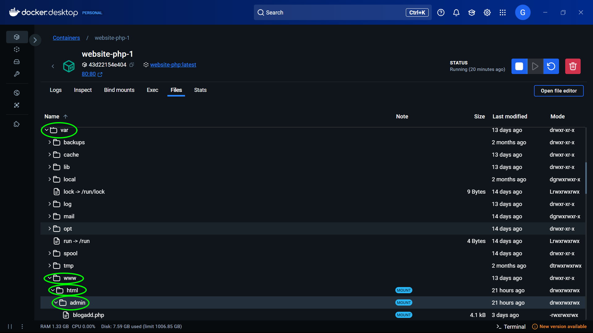
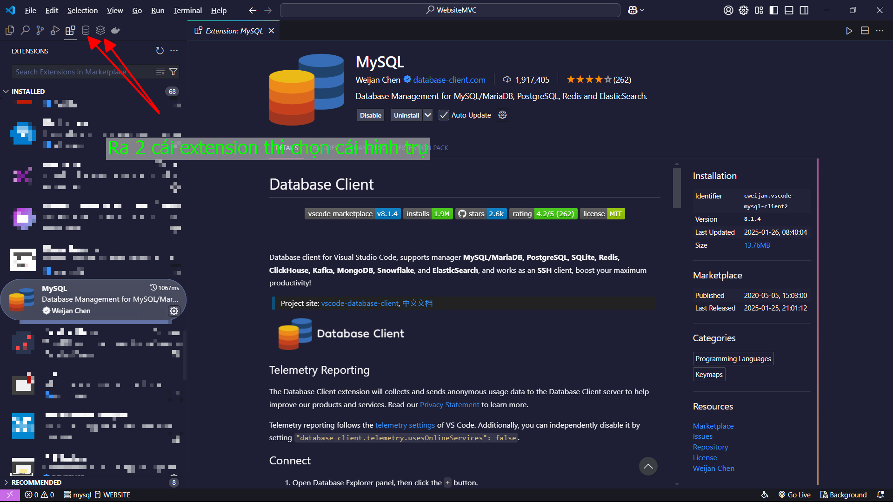
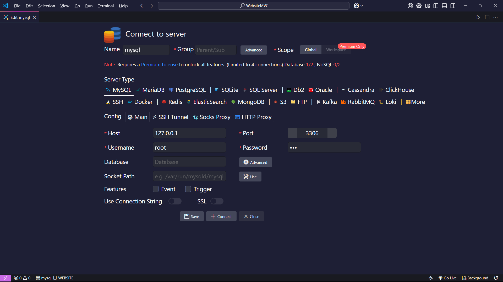
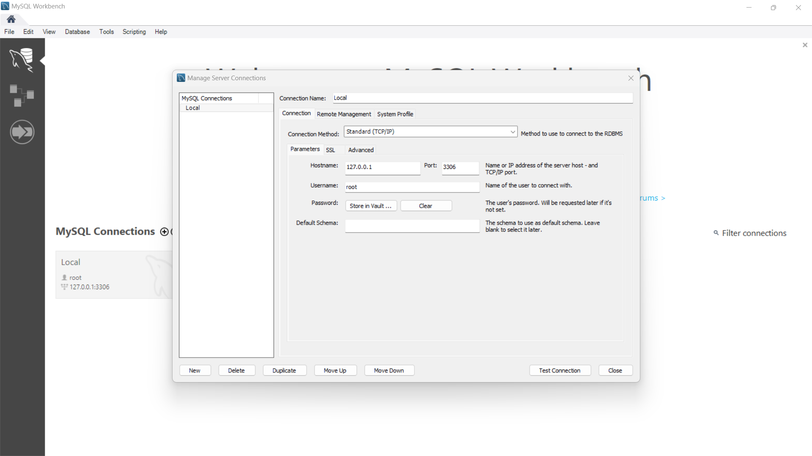
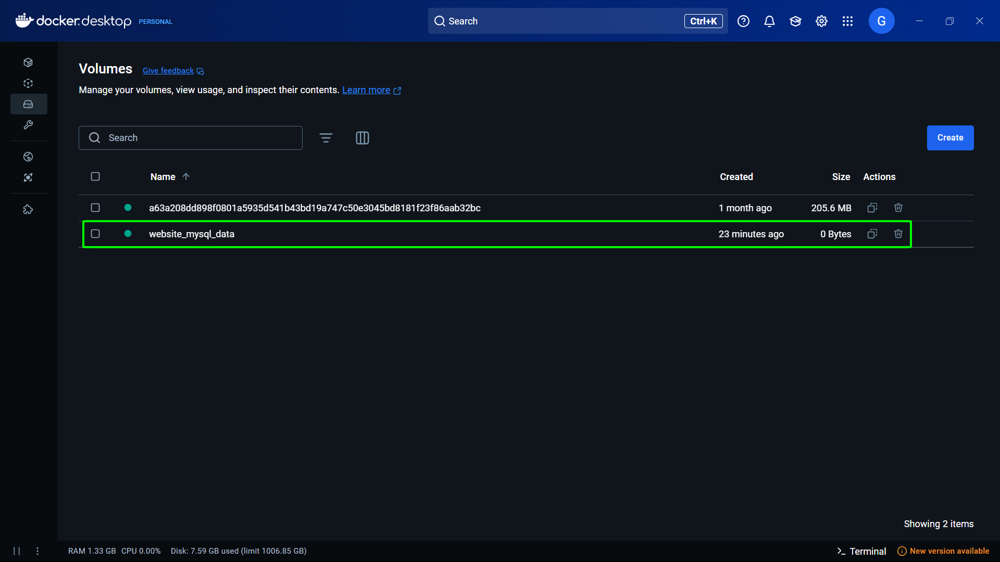

# 🚀 Hướng Dẫn Sử Dụng

## 📌 Mục Lục

1. [Giới thiệu](#giới-thiệu)
2. [Công nghệ sử dụng](#💻-công-nghệ-sử-dụng)
3. [Cách chạy chương trình](#cách-chạy-chương-trình)
    - [Chạy bằng Docker](#cách-1-chạy-bằng-docker)
    - [Chạy bằng XAMPP](#cách-2-chạy-bằng-xampp)
4. [Xem cơ sở dữ liệu](#xem-cơ-sở-dữ-liệu)
5. [Tổng hợp lệnh Docker](#tổng-hợp-lệnh-docker)

---

## 📖 Giới Thiệu

Dự án này là làm theo kênh [của Hiếu Tutorial with live project](https://youtube.com/playlist?list=PLWTu87GngvNwRxrFZ_wbxfvHHed14H5RC&si=1sXmTl2WHD_ElVrx) và được cãi tiến và thay đổi đi bớt code cho phù hợp!

## 💻 Công Nghệ Sử Dụng

### Ngôn ngữ lập trình:

| HTML                                                                                | CSS                                                                               | JS                                                                                            | PHP                                                                             | MySQL                                                                                        |
| ----------------------------------------------------------------------------------- | --------------------------------------------------------------------------------- | --------------------------------------------------------------------------------------------- | ------------------------------------------------------------------------------- | -------------------------------------------------------------------------------------------- |
|  |  |  |  |  |

### Framework

| Bootstrap                                                                                   |
| ------------------------------------------------------------------------------------------- |
|  |

### Technology

| Docker                                                                                | Git                                                                             |
| ------------------------------------------------------------------------------------- | ------------------------------------------------------------------------------- |
|  |  |

## 📌 Cách Chạy Chương Trình

### Cách 1: Chạy bằng Docker

**Step 1:** Clone dự án hoặc tải file `.rar` về máy

```sh
git clone https://github.com/Glasspham/Web_PHP_SQL.git
```


**Step 2:** Truy cập vào thư mục chứa project

```sh
cd path/to/project
```

Ví dụ trong máy tôi: `path/to/project` = `E:\Code\WebsiteMVC` => cd `E:\Code\WebsiteMVC`


**Step 3:** Chạy Docker Compose

```sh
docker-compose up -d
```


**Step 4:** Kiểm tra container có chạy không

-   Lệnh:

```sh
docker ps
```


-   Docker Desktop:

_Check Images_


_Check Containers_


**Step 4:** Mở trình duyệt và truy cập

-   Trang chủ: [http://localhost](http://localhost)


Tài khoản login vào website thử:

```sh
Tài khoản: dongoc@gmail.com
Password: 123
```

-   Trang admin: [http://localhost/admin](http://localhost/admin)


Tài khoản login vào admin thử:

```sh
Tài khoản: glassadmin
Password: 123
```

#### Lưu ý:

Trang admin có thể bị lỗi `Cannot modify header information - headers already sent by (output started at ...` thì làm theo các bước sau:

_Step 1:_ Open `Docker Desktop` >> nhấn vào container `php-1`


_Step 2:_ Nhấn vào `Files`


_Step 3:_ Nhấn lướt xuống tìm Folder `var` >> `www` >> `html` >> `admin`



_Step 4:_ Kiểm tra File `header.php` nằm trong Folder `inc` và File `login.php`. Xem dòng đầu:

Đây là sai! Vì có 1 khoảng cách trước

```sh
.<?php
    //Code
?>
```

Đây là sai! Vì có 1 dòng trắng phía trước

```sh
...
<?php
    //Code
?>
```

Dấu . đại diện cho khoảng trắng thừa

Đây là đúng!

```sh
<?php
    //Code
?>
```

### Cách 2: Chạy bằng XAMPP

-   Cài đặt XAMPP từ [Apache Friends](https://www.apachefriends.org/download.html).
-   Chạy Apache và MySQL.
-   Import file `init.sql` vào `http://localhost/phpmyadmin`.
-   Mở trình duyệt và truy cập `http://localhost`.

## 🗃 Xem Cơ Sở Dữ Liệu

**Cấu hình kết nối:**

```sh
Host: 127.0.0.1
User: root
Port: 3306
Password: 123
```

Password có thể sửa ở trong file `docker-compose.yml`

Có thể dùng một trong các cách sau để quản lý CSDL:

### 1. Dùng Extension `MySQL By Weijan Chen` trên VSCode

[Tải về](https://marketplace.visualstudio.com/items?itemName=cweijan.vscode-mysql-client2)

_Tải về:_




### 2. Dùng MySQL Workbench

[Tải về](https://dev.mysql.com/downloads/workbench/)



### 3. Dùng Adminer (trên Docker)

```sh
docker run --name myadmin -d --link mysql:db -p 8080:8080 adminer
```

Sau đó vào `http://localhost:8080`.

## Lưu ý:

Trong File `docker-compose.yml` tôi có đoạn:

```sh
- mysql_data:/var/lib/mysql

volumes:
  mysql_data:
```



Giúp lưu giữ lại data ở phiên làm việc trước đó. Nếu cập nhật `docker-compose.yml`, cần chạy lệnh sau để áp dụng thay đổi:

```sh
docker compose down
docker compose build --no-cache
docker compose up -d
```

nếu không sẽ chạy data lại từ đầu như trong File `init.sql` đã được setup trước!

Và muốn tạo 1 file back up .sql khi đã cập nhật thêm dữ liệu thì có thể dùng lệnh:

```sh
docker exec -i <mysql-container-name> mysqldump -u root -p --default-character-set=utf8mb4 -p<password-container> <name-database> > <filename>.sql
```

Muốn cập nhật lại bằng file back up .sql thì dùng lệnh:

```sh
docker exec -i <mysql-container-name> mysql -u root -p --default-character-set=utf8mb4 -p<password-container> <name-database> < <filename>.sql
```

## 🛠 Tổng Hợp Lệnh Docker

Có thể dùng `docker-compose` hoặc `docker compose`.

### 1. `Xây dựng và tải các Iamge

-   Build image

```sh
docker compose build
```

-   Build lại image

```sh
docker compose build --no-cache
```

### 2. Xây dựng và chạy container

```sh
docker-compose up -d
```

### 3. Dừng và khởi động lại container

-   **Stop container**

```sh
docker-compose stop
```

-   **Start container**

```sh
docker-compose start
```

### 4. Xóa container

-   Xóa mỗi container:

```sh
docker-compose down
```

-   Xóa container và volumes:

```sh
docker-compose down -v
```

### 5. Export Database

```sh
docker exec -i <mysql-container-name> mysqldump -u root -p --default-character-set=utf8mb4 -p<password-container> <name-database> > <filename>.sql
```

_Ví dụ:_

```sh
docker exec -i website-db-1 mysqldump -u root -p --default-character-set=utf8mb4 -p123 WEBSITE > backup.sql
```

### 6. Import Database

```sh
docker exec -i <mysql-container-name> mysql -u root -p --default-character-set=utf8mb4 -p<password-container> <name-database> < <filename>.sql
```

_Ví dụ:_

```sh
docker exec -i website-db-1 mysql -u root -p --default-character-set=utf8mb4 -p123 WEBSITE < backup.sql
```

## 📢 Kết Luận

README này giúp bạn cài đặt và chạy dự án dễ dàng hơn. Nếu có vấn đề, hãy mở issue trên GitHub hoặc liên hệ trực tiếp!

🚀 **Chúc bạn thành công!**
