# Giới Thiệu

Dự án này là làm theo kênh [của Hiếu Tutorial with live project](https://youtube.com/playlist?list=PLWTu87GngvNwRxrFZ_wbxfvHHed14H5RC&si=1sXmTl2WHD_ElVrx) và được cãi tiến và thay đổi đi bớt code cho phù hợp!

## 💻Languages and Tools 

### Languages:

| HTML | CSS | JS | PHP | MySQL |
|----------|----------|----------|----------|----------|
|  |  |  |  |  |

### Framework

| Bootstrap |
|----------|
|  |

### Technology

| Docker | Git |
|----------|----------|
|  |  | 

# Cách chạy chương trình

## Cách 1: Chạy bằng `Docker`

**Step 1:** Tải folder `.rar` hoặc git clone về máy. Chú ý nhớ đường dẫn (path)!

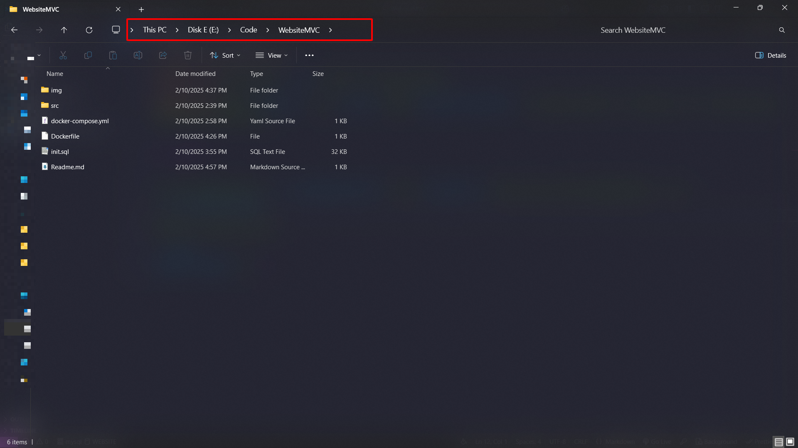

**Step 2:** Open `terminal` của `vscode` hoặc `Window PowerShell` của máy có sẵn. Trỏ đúng vị trí chứa thư mục bằng lệnh cd như sau:

```bash
cd `path`

```

Ví dụ trong máy tôi: path = `E:\Code\WebsiteMVC` file `Dockerfile` nằm trong folder WebsiteMVC. => cd `E:\Code\WebsiteMVC`

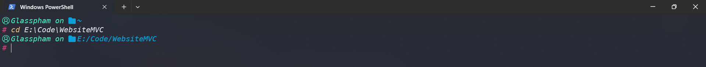

**Step 3:** Nhập câu lệnh này vào để khởi tạo image + run container

```bash
docker-compose up -d
```

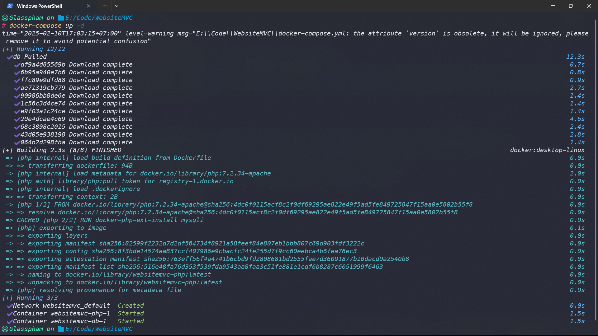

Để check xem trong docker đã tạo ra 2 image thì dùng lệnh:

```bash
docker ps
```

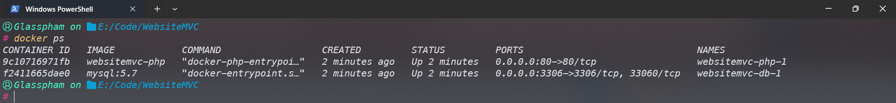

Hoặc tải Docker Desktop về sẽ coi được image với container dễ dàng hơn như 2 hình dưới đây:

Check Images

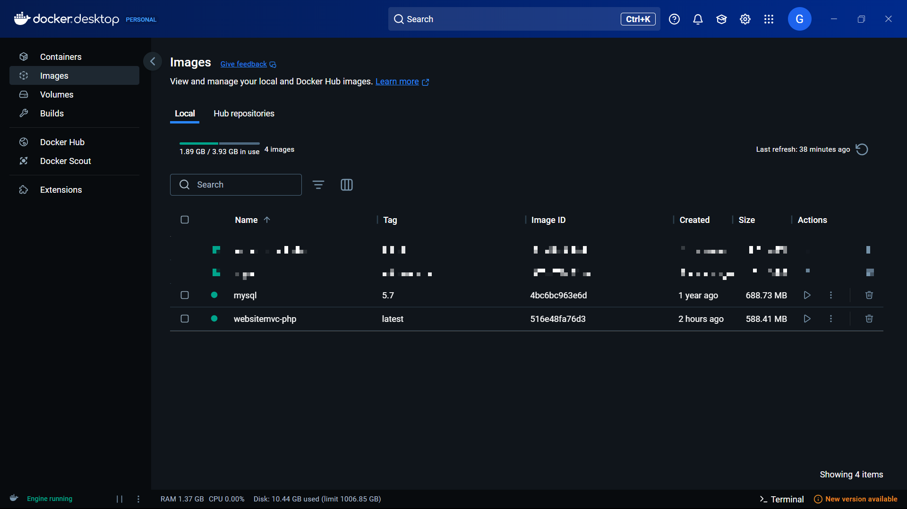

Check Containers

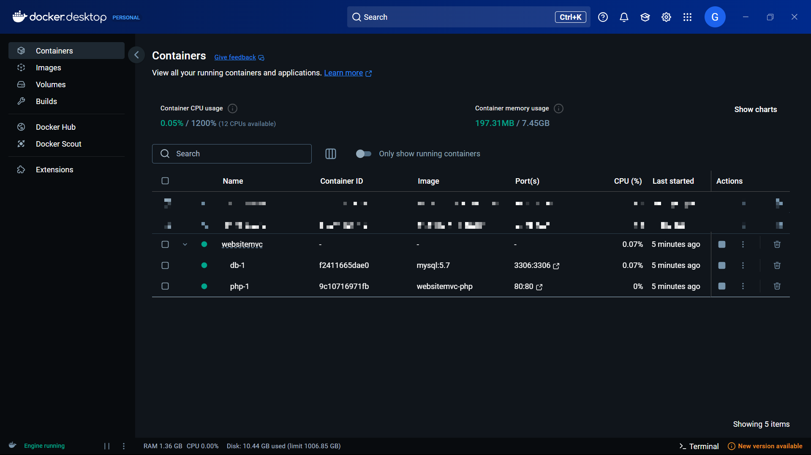

**Step 4:** Khi thấy container đã chạy thì mình vào 1 browser nhập vào localhost sẽ ra web.

_Trang chủ_

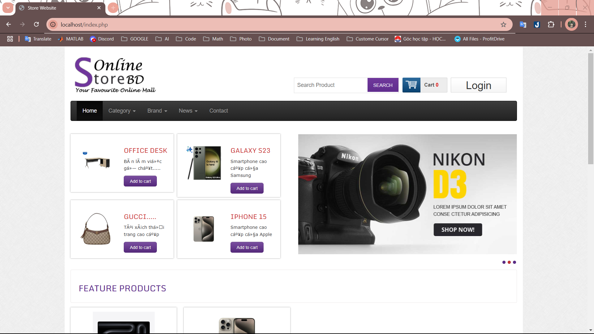

_Trang cho admin_

```bash
Tài khoản: glassadmin
Password: 123
```
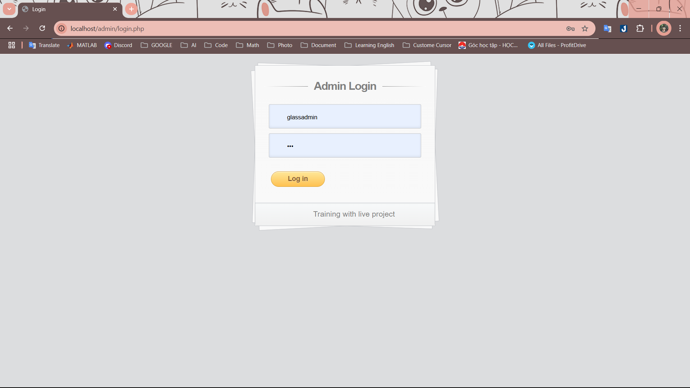
<br>
<br>
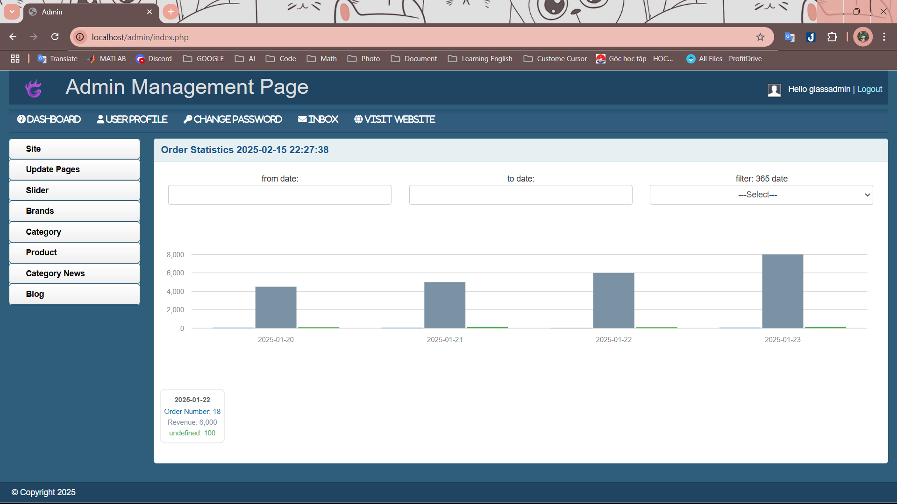

# Xem cơ sở dữ liệu

Có thể dùng extension `MySQL By Weijan Chen` của `vscode` như tôi liên kết với hệ thống để coi CSDL hoặc dùng `MySQL Workbench` hoặc dùng `adminer` một `Image` quản lý MySQL trên [Docker Hub](https://hub.docker.com/_/adminer).

**1. Extension MySQL**

_Tải về:_
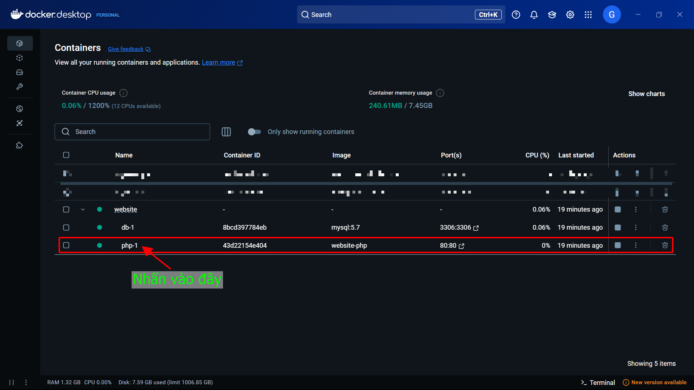

_Thông tin kết nối:_

Password có thể sửa ở trong file `docker-compose.yml`

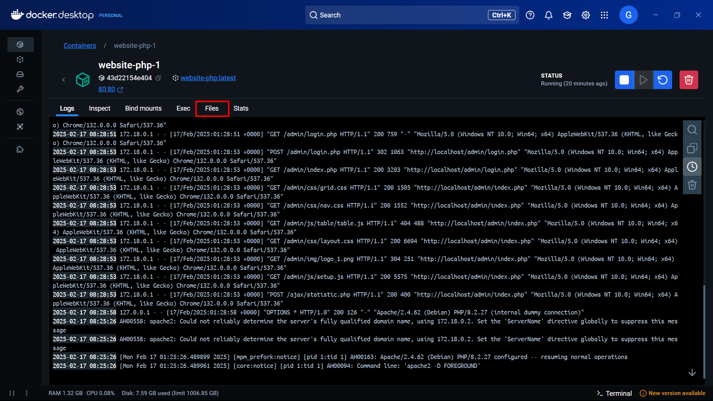

## Cách 2: Chạy bằng [Xampp](https://www.apachefriends.org/download.html) vào kênh youtube mà tôi làm theo sẽ có hướng dẫn chạy bằng xampp. Rồi bạn import file `init.sql` vào trong `http://localhost/phpmyadmin`.